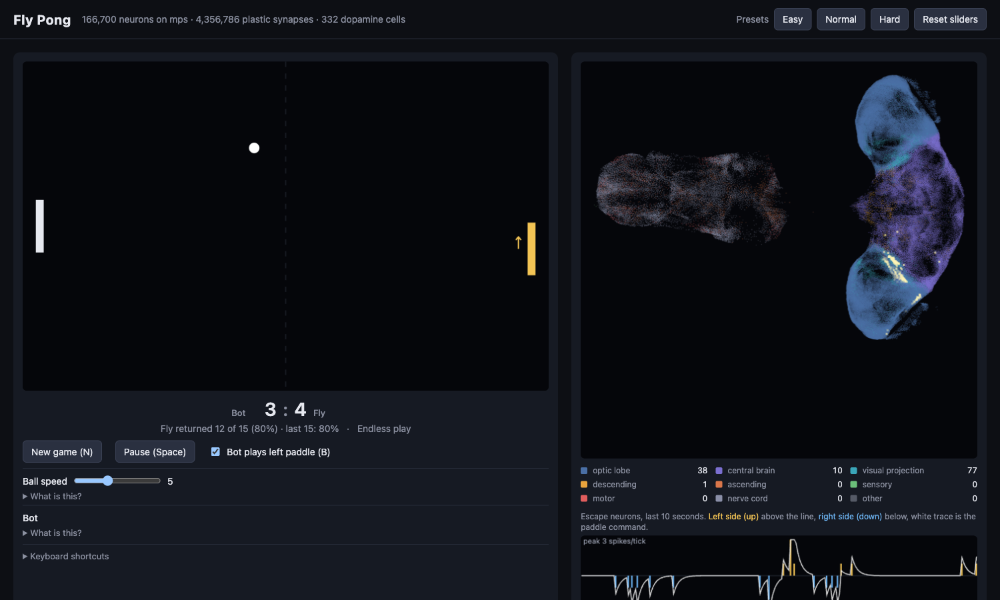

# Fly Pong

Pong where the right paddle is a live simulation of the complete adult male
fruit fly central nervous system: 166,700 neurons and 25.6 million connections
from the MaleCNS v1.0 connectome, stepping every frame on an Apple Silicon GPU.



## How it works

The fly sits at the right paddle facing left, seen from above. Its left eye
covers the top half of the screen, its right eye the bottom half.

- **Seeing.** Each frame the ball is painted onto the lamina (retina) columns
  of the matching eye, and the looming detectors on that side (LC4 and LPLC2)
  receive a signal that grows as the ball approaches.
- **Thinking.** The whole brain steps live, with state carried between
  frames and no resets during a game. A slider sets brain milliseconds per
  game frame (default 4). On an M3 Pro that is about 22 brain updates per
  second. Reaction latency is real: the escape pathway needs about 8 brain
  milliseconds from stimulus to descending output.
- **Moving.** No training. Left-side descending neurons firing move the
  paddle up, right-side down. The cells that fire are DNp02 and DNp04, the
  fly's real looming-escape neurons, which the connectome wires strictly
  to one side.

The one shortcut on the sensory side, stated on the page too: the link from
the retina image to the looming detectors is computed by this program,
because the simplified leaky integrate-and-fire model cannot carry a small
patch of retinal input through the fly's lobula. Everything downstream of
the looming detectors is the fly's own wiring.

## Learning

The fly learns from reward and punishment through its own synapses, and
remembers across restarts.

- **Dopamine is real cells.** Returning the ball stimulates the fly's 316
  PAM dopamine neurons; missing it stimulates its 16 PPL1 neurons. These
  are the cells a real fly uses for reward and punishment. Their spikes
  travel down their real axons, rebuilt from the raw synapse counts, to the
  8,599 neurons they actually innervate: 4,061 of the 4,064 Kenyon cells and
  all 97 output neurons of the mushroom body, the fly's learning center,
  plus 74 descending neurons.
- **Three-factor plasticity.** 4.36 million synapses (everything onto a
  dopamine-innervated neuron, plus the visual-projection-to-descending
  pathway that drives the paddle) keep an eligibility trace that rises when
  the sending cell fired just before the receiving cell and fades over 100
  brain milliseconds. Each tick, every eligible synapse that received
  dopamine changes: reward strengthens, punishment weakens, scaled by the
  learning rate. Synapses never change sign and stay between 0.1x and 4x
  their original strength.
- **Memory.** Learned weights are saved to `data/learned.npz` every minute
  and on shutdown, and reloaded at start. "Forget everything" restores the
  original connectome.

Two additions are ours, not the fly's, and the page says so: a weak diffuse
dopamine signal also reaches the paddle pathway (mushroom-body output cannot
reach the escape neurons in this model, so without it learning could never
change play), and reward potentiates while punishment depresses, where the
real mushroom body depresses in both cases with valence set by which output
neuron is affected.

One honest finding: in Pong the mushroom body never changes, because nothing
in the game drives its Kenyon cells. All of the learning happens on the
reflex pathway. The fly cannot learn a new direction of movement, which is
fixed by anatomy; it can only learn how fast and how hard to react.

### Measured (2026-09-14, bot opponent, ball speed 5, default settings)

One clean session, single tab, from a fresh Forget:

| Phase | Balls faced | Returned | Synapses changed |
|---|---|---|---|
| Original connectome, learning off, 3 min | 37 | 32 (86%) | 0 |
| Learning on, 5 min (37 rewards, 27 punishments) | 64 | 37 (58%) | 24,916, by 7.1% on average |
| Trained weights frozen, learning off, 3.5 min | 48 | 23 (48%) | 24,916 |

So with this rule the fly learns, and gets worse. The mechanism did exactly
what it was built to do: every miss weakened the reflex synapses that had
just fired, which made the next approach slower, which caused another miss.
A punishment spiral. Rewards could not outrun it because the fly's reaction
time, not its reflex strength, is what loses rallies at this ball speed.

The obvious fix, not yet applied: let the diffuse signal that reaches the
paddle pathway carry reward only, and keep punishment where the real PPL1
axons actually go, the mushroom body. That is arguably more faithful, since
the diffuse signal was our addition in the first place. It would let the
reflex strengthen with success (up to the 4x cap) and never be weakened by
failure. Whether that improves play is a measurement for another session.

Slow the ball down and the fly returns nearly everything; speed it up and
its reaction time loses regardless of learning.

## Realism batch (2026-09-14)

Seven changes aimed at narrowing the gap to a real fly brain, each
measured on the M3 Pro.

1. **Full transmitter table.** The project builds its own graph
   (`data/graph.npz`, same neuron order as upstream) with histamine, the
   photoreceptor transmitter, as the fast inhibitory transmitter it is.
   Mute neurons drop from 11,609 to 3,718; 89,723 photoreceptor synapses
   now transmit.
2. **The published neuron model.** Shiu et al. 2024 parameters: rest and
   reset -52 mV, threshold -45 mV, 20 ms membrane, 5 ms exponential
   synapses, 0.275 mV per synapse into the synaptic variable, 1.8 ms delay,
   2.2 ms refractory period, inputs dropped while refractory. Integrated
   exactly per step, so 1, 0.5 and 0.25 ms steps agree. Event-driven
   propagation touches only the synapses of neurons that spiked: idle
   speed is 2,500 steps per second, 2.5x real time, and about 400 to 1,000
   during play.
   Two findings on the way: a first draft calibrated each synapse's
   membrane peak to 0.275 mV, six times the original, and one stimulus
   ignited the whole brain. And even at the correct strength, sustained
   input ignites a self-sustained 10 Hz state. Short-term synaptic
   depression (20% of transmitter per spike, 300 ms recovery, real but not
   in the published model) stops that: activity dies down when input stops.
3. **Spontaneous activity.** A noise current. With depression, 0.6 to
   1.0 mV gives a 1 to 3 Hz idle like a real fly, but the escape readout
   drowns in it: left-right separation is 2.7:1 at zero noise, 1.9:1 at
   0.5 mV, gone at 1.0. Default 0.5 mV, near-silent idle, playable.
4. **Inhibition scaled by 2.** At the published 1x the mushroom body
   ignites (Kenyon cells at 21 Hz each; real ones fire below 1 Hz) and the
   escape signal is 1.5:1. At 2x Kenyon cells fire at 0.7 Hz, brain-wide
   activity during play is about 2 Hz, and the escape signal is 4:1.
5. **The real eye.** 5,895 photoreceptors inherit an eye column and an eye
   from the lamina cell they synapse on most (their cell bodies are outside
   the imaged volume). Constant light with the ball as a dark spot, the
   stimulus a real fly's escape circuit responds to. Result: it does not
   reach the escape neurons. With the shortcut off, escape activity is the
   same for a ball above or below in every light condition, and the looming
   detectors never fire from retinal input. Real lamina neurons are
   non-spiking graded cells; a spiking model cannot carry a small patch of
   retina through them. The shortcut stays on; the switch is on the page.
6. **Dopamine as prediction error.** Reward and punishment bursts scale
   with surprise against a running expectation of the fly's return rate.
   Diffuse punishment on the reflex pathway is off by default (it caused
   the earlier spiral). Eligibility is now causal: each neuron's
   presynaptic trace (20 ms) credits the synapses onto a neuron when it
   fires.
7. **Mushroom-body input and motor-neuron readout.** The 252 visual
   projection neurons onto Kenyon cells see the ball, so the fly's
   learning center participates. The paddle can be read from the 708
   nerve-cord motor neurons instead of the escape neurons; measured, they
   fire nearly equally on both sides for a ball above or below (turning
   uses both sides), so as an up-or-down number it barely works. A physics
   body was out of scope.

The escape readout itself changed: with the richer model the whole
descending population fires bilaterally, so the paddle now follows the 320
DNp cells (160 per side), the giant fiber and its looming-escape partners,
which stay cleanly one-sided.

### Measured session on the new brain

Same protocol as before (bot, ball speed 5, defaults, single tab, from a
fresh Forget), on the Shiu model with inhibition x2 and depression:

| Phase | Balls faced | Returned | Synapses changed |
|---|---|---|---|
| Original connectome, learning off, 3 min | 35 | 23 (66%) | 0 |
| Learning on, 5 min (34 rewards, 45 punishments) | 79 | 34 (43%) | mushroom body 1.35 M by 2.1%, reflex pathway 1.19 M by 0.6% |
| Trained weights frozen, learning off, 3.5 min | 52 | 29 (56%) | same |

Verdict, second time: learning does not improve play, and this time the
punishment spiral is not the reason (punishment never reached the reflex
pathway). The changes are simply too broad. With the richer model a return
is preceded by activity across a million synapses, so reward-driven
potentiation spreads over the whole pathway and raises excitability
everywhere, which blurs the left-right escape signal the paddle depends on
rather than sharpening the reflex that earned the reward. What it would
take: credit assignment that is sparse in space and tight in time, and a
paddle readout that normalizes for overall excitability. Both are
measurable next steps, not fixes applied here.

### Third session: sparse credit and a normalized readout

Two changes aimed at that diagnosis: reward now reaches only the reflex arc
(the 237,432 synapses leaving the looming detectors or landing on the 320
escape neurons, instead of 1.2 million), and the paddle command divides the
left-right difference by a slow running average of total escape activity,
so a globally more excitable brain gives the same command. Same protocol:

| Phase | Balls faced | Returned | Synapses changed |
|---|---|---|---|
| Original connectome, learning off, 3 min | 39 | 27 (69%) | 0 |
| Learning on, 5 min (38 rewards, 30 punishments) | 68 | 38 (56%) | reflex arc 180,022 by 2.1%, mushroom body 1.34 M by 2.0% |
| Trained weights frozen, learning off, 3 min | 52 | 26 (50%) | same |

Verdict, third time: still no improvement, and the drop is now smaller but
consistent. Three sessions with three different mechanisms (symmetric
reward and punishment, reward-only over the broad pathway, reward-only over
the sparse arc with a normalized readout) all leave the trained fly worse
than the untrained one. The conclusion this project can support: in this
model, reward-modulated Hebbian strengthening of the escape pathway does
not make the reflex a better Pong player. Strengthening the synapses that
fired before a return makes the next reaction on that side stronger and
earlier, and the evidence says that overshoots more often than it helps.
What a real fly learns with is a different circuit (the mushroom body
choosing between behaviors), which this model cannot connect to the paddle.
The learning system stays on the page, honestly labeled, because watching
real dopamine neurons rewrite real synapses is the point; it is not sold as
improvement.

The untrained fly is also weaker on this brain than on the first one (66%
to 69% against 86%). The first model's normalized weights made the escape
pathway an almost noise-free relay; the published model with realistic
activity levels gives a noisier, more lifelike reflex. The page is tuned
for realism, not for the score.

### Fourth session (2026-09-15): what a fly wants, and a learning window that can reach the cause

Three things changed, all toward the animal:

- **Reward and punishment through the fly's own senses.** A return now
  puts sugar on its mouth: its 275 labellar taste neurons fire for 300 ms
  (the data set does not separate sugar cells from bitter ones, so all of
  them). A miss puts heat on its antennae: its 7 hot cells (type TRN_VP2,
  the arista hot cells' glomerulus) fire for 300 ms, the punishment of the
  classic flight-simulator experiments in which tethered flies learn to
  steer away from heat. Sliders "Sugar reward" and "Heat punishment".
- **A dopamine injection switch.** The direct PAM/PPL1 bursts of the first
  three sessions can be turned off, leaving the fly's own taste and heat
  circuits to make the dopamine.
- **A 1.5 s eligibility window** instead of 100 ms. The paddle move that
  returns or loses a ball happens half a second to a second before the
  outcome; with 100 ms the credit had decayed to nothing by the time the
  dopamine arrived. In the mushroom body the pairing window between
  Kenyon-cell activity and dopamine is seconds long.

Measured first whether the senses reach the dopamine cells at all
(`uv run python -m flypong.train --probe`, 300 ms windows, 5 trials):

| stimulus | taste cells | hot cells | PAM (reward dopamine) | PPL1 (punishment dopamine) |
|---|---|---|---|---|
| nothing | 68 | 6 | 94 | 40 |
| sugar on the mouth | 18,206 | 3 | 96 | 68 |
| heat on the antennae | 77 | 474 | 101 | 41 |

The taste and hot cells fire hard, the dopamine cells do not move. So in
this network the fly tastes its reward and feels its punishment, but its
own circuits do not turn either into dopamine; the injection stays on by
default and is labeled for what it is. The headless trainer
(`uv run python -m flypong.train --fresh --balls 100 300 100`) then ran
the same protocol as the earlier sessions, unattended, against the bot,
from the original connectome: 100 balls with learning off, 300 with
learning on, 100 with the trained weights frozen.

| Phase | Balls | Returned | Per 50 balls | Synapses changed |
|---|---|---|---|---|
| Original connectome, learning off | 100 | 92 (92%) | 96, 88 | 0 |
| Learning on, sugar and heat, injection on, 1.5 s window | 300 | 237 (79%) | 82, 66, 76, 76, 88, 86 | mushroom body 2.06 M by 152% on average, reflex arc 224,179 by 17.7% |
| Trained weights frozen, learning off | 100 | 88 (88%) | 88, 88 | same |

Verdict, fourth time: still no improvement over the untrained reflex (88%
against 92%), but two things are new. The drop is the smallest of the four
sessions, and for the first time the training curve recovered: it fell to
66% in the second block of 50 balls and climbed back to 86 to 88% by the
end, and stayed there when frozen. The longer window let the reward reach
the causing synapses, and the fly settled into a new stable state; that
state is simply not a better Pong player than the wiring it started with.
The headless fly also returns far more than the browser one (92% against
66 to 86% in the earlier sessions) because it gets exactly 4 brain
milliseconds every frame, where the page's tick rate rises and falls with
the machine.

**Punishment only** (`--reward 0`: heat after a miss, nothing for a
return, the way the flight-simulator flies learn), same protocol:

| Phase | Balls | Returned | Per 50 balls | Synapses changed |
|---|---|---|---|---|
| Original connectome, learning off | 100 | 91 (91%) | 92, 90 | 0 |
| Learning on, heat only | 300 | 235 (78%) | 82, 80, 76, 78, 78, 76 | mushroom body 1.98 M by 137%, reflex arc 25,358 by 69% |
| Trained weights frozen | 100 | 78 (78%) | 82, 74 | same |

Worse than reward and punishment together, and flat: no recovery.

**What the two runs together show.** With no reward at all, the mushroom
body still changed two million synapses by 137% on average, almost the
same as with reward (152%). That change cannot come from the outcomes;
it comes from the dopamine cells' own spontaneous firing (about 300
spikes per second across the 332 cells at rest), which with a 1.5 s
eligibility window potentiates every recently active synapse all the
time. So most of what the page calls learning is drift driven by tonic
dopamine, and the outcome-driven part rides on top of it as a small
perturbation. That is the likeliest reason every session lands a little
below the untrained reflex: the mushroom body is being randomly rewritten,
not taught. The fix this implies is the one real dopamine systems use:
plasticity should follow the phasic deviation from the tonic level, not
the level itself. It is not implemented; five sessions is where this
project stops and says what it found.

## Setup

1. Clone and build the upstream simulator next to this folder:
   ```sh
   cd ~/Developer
   git clone https://github.com/seohyunjun/mps-malecns-model.git
   cd mps-malecns-model
   python3 -m venv .venv
   .venv/bin/python -m pip install -r requirements-lock.txt
   .venv/bin/python -m malecns download    # 1.1 GB of official data
   .venv/bin/python -m malecns prepare     # builds data/graph.npz
   ```
2. Install and build the atlas:
   ```sh
   cd ~/Developer/fly-pong
   uv sync
   uv run python -m flypong.atlas
   ```
3. Run:
   ```sh
   uv run python -m flypong
   ```
   Open http://127.0.0.1:8765/. Set `FLYPONG_DATA` if the simulator lives
   somewhere else.

## Controls

W moves your paddle up and S moves it down. Space pauses. B hands your paddle to a bot.
N starts a new game. First to 7 points wins; the page tracks the fly's
return rate as you play, and pauses itself when the tab is hidden.

Sliders: ball speed, brain ms per frame, looming strength, retina strength,
motor gain. Every setting has a "What is this?" dropdown explaining what it
changes and which real neurons are involved. Easy, Normal and Hard presets
set ball speed and brain time together; "Reset sliders" restores defaults.

The brain panel shows a color legend of the nine neuron classes with live
spike counts per tick, and a ten-second strip chart of left versus right
escape-neuron spikes with the resulting paddle command.

## Tests

```sh
uv run pytest -q
```

## Credits

MaleCNS v1.0 data: FlyEM / HHMI Janelia, University of Cambridge, MRC
Laboratory of Molecular Biology, and Google Research, CC BY 4.0.
Simulator: [seohyunjun/mps-malecns-model](https://github.com/seohyunjun/mps-malecns-model),
used unmodified. Fly Pong code: MIT.
